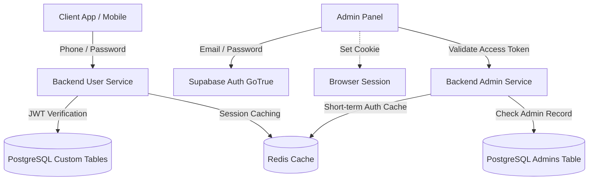

# Authentication & Session Architecture

MyClinical implements a segregated authentication strategy to separate the public-facing customer application from the elevated administration panel. 

---

## 1. High-Level Partitioning



| Feature | User Authentication | Admin Authentication |
|---|---|---|
| **Identity Base** | Phone Number (normalized) | Email Address |
| **Credential Manager** | bcrypt (rounds=12) validated in backend | Supabase GoTrue (Managed Service Engine) |
| **Token Format** | Handcrafted Local JSON Web Token (JWT) | Supabase-signed GoTrue JWT |
| **Session Model** | Stateful database track (`user_sessions` table) | Stateless JWT (Supabase revoked on demand) |
| **Session Cache** | Redis hash entries (`session:<token_hash>`) | Redis hash entries (`auth_token_v1:<token_hash>`) |
| **Cookie Name** | `user_session` | `session` |

---

## 2. User Authentication (Custodial System)

Security for regular users is decoupled from Supabase GoTrue. This bypasses GoTrue's email-centric architecture, allowing a custom phone-number lookup and credentials database.

### Identity & Credential Store
- **Hashing Algorithm**: `bcryptjs` with a cost factor of `12` rounds.
- **Normalisation**: Phone numbers are cleared of non-numeric characters and Arabic-Indic characters are converted to standard Western digits before comparison and insertion.
- **Verification**: Verified server-side during the `/api/auth/login` route.

### Session Lifecycle Management
Every successful user login generates a new session:
1. **JWT Generation**: A locally signed JWT containing `{ userId, type: 'user' }` is generated using a private key (`JWT_SECRET`) and a configurable TTL (defaults to 7 days).
2. **Session Persistence**: A stateful entry is created in the database table `user_sessions`. It logs metadata for audit trails:
   - `user_id`: Relation to the specific user record.
   - `token_hash`: A secure SHA-256 hash representation of the raw JWT.
   - `device_info`: The sender's User-Agent string.
   - `ip_address`: The IP of the requesting client.
   - `is_active`: Activity Boolean flag (allows instantaneous remote revocation).
   - `expires_at`: Expiration timestamp (matches the token validity duration).

---

## 3. Admin Authentication (Supabase GoTrue Engine)

Admins are authenticated directly through GoTrue (Supabase's built-in OAuth2/OIDC/password flow engine) to leverage Supabase's identity provider functionality.

### Credential Handling
- **Authentication**: When logging in via `/api/admin/login`, the admin credentials (email + password) are posted directly to the standard public-facing Supabase endpoint using `supabasePublic.auth.signInWithPassword`.
- **Identity Check**: If GoTrue resolves the credentials, the backend validates that the returned UUID is present in the local `admins` table. If the UUID is absent, the backend denies access (with a `403 Access Denied` response) and blocks the session.
- **Token Format**: The access token returned by GoTrue is a JWT containing standard sub, email, role, and provider claims.

---

## 4. Database Schema Structure

The authentication system integrates with PostgreSQL on Supabase through three tables containing specific constraints:

### 1. `users` Table
Stores basic profile and cryptographic passwords for regular customers and doctors.
```sql
CREATE TABLE users (
  id uuid PRIMARY KEY DEFAULT gen_random_uuid(),
  phone_number text UNIQUE NOT NULL,
  password_hash text NOT NULL,
  display_name text,
  is_active boolean DEFAULT true,
  role text DEFAULT 'user', -- 'user' or 'doctor'
  verification_status text DEFAULT 'none', -- 'none', 'pending', 'approved', 'rejected'
  syndicate_card_url text, -- file identifier for doctors
  clinic_address text, -- doctors list clinic details
  -- additional credentials columns
  created_at timestamptz DEFAULT now(),
  updated_at timestamptz DEFAULT now()
);
```

### 2. `user_sessions` Table
Maintains active and historical logins for customers and doctors, enabling multi-device controls.
```sql
CREATE TABLE user_sessions (
  id uuid PRIMARY KEY DEFAULT gen_random_uuid(),
  user_id uuid REFERENCES users(id) ON DELETE CASCADE NOT NULL,
  token_hash text NOT NULL,
  device_info text,
  ip_address text,
  expires_at timestamptz NOT NULL,
  created_at timestamptz DEFAULT now(),
  is_active boolean DEFAULT true
);
```
- **Indexes**:
  - `user_sessions_user_idx` on `user_id` (improves multi-session invalidation speed).
  - `user_sessions_token_idx` on `token_hash` (optimizes token lookup queries).
  - `user_sessions_expires_idx` on `expires_at` (optimized for cleanup queries).

### 3. `admins` Table
Verifies administrative permissions for the back-office control panel.
```sql
CREATE TABLE admins (
  id uuid PRIMARY KEY, -- matches the UUID in auth.users managed by GoTrue
  email text UNIQUE NOT NULL,
  role text DEFAULT 'editor', -- 'admin', 'editor', etc.
  created_at timestamptz DEFAULT now()
);
```

---

## 5. Redis Caching & Invalidation Layer

To avoid hitting Supabase for token validation on every endpoint request, a two-layer cache is implemented using Redis.

```
Request Received ──> Hash Token (SHA-256) ──> Consult Redis ──[Hit]──> req.user populated ──> Route
                                                 │
                                              [Miss]
                                                 │
                                                 ▼
                                       Query Supabase / Verify JWT
                                                 │
                                                 ▼
                                        Write Cache & Continue
```

### Caching Strategies

#### 1. User Session Caching
- **Key Schema**: `session:<sha256(raw_jwt_token)>`
- **Cached Payload**: `{ user: req.user, sessionId: req.sessionId }`
- **TTL**: 300 seconds (5 minutes)
- **Rationale**: Balances database read reduction with relatively fast synchronization of user-disablement or permissions updates.

#### 2. Admin Token Caching
- **Key Schema**: `auth_token_v1:<sha256(raw_supabase_access_token)>`
- **Cached Payload**: `{ user: req.user, admin: req.admin }`
- **TTL**: 60 seconds (1 minute)
- **Rationale**: Admin roles hold high privileges. Minimizing compilation to 60 seconds prevents long-running unauthorized access if an admin is demoted or disabled.

### Invalidation Triggers
- **Single Logout**: Deletes the specific key from Redis (`session:<token_hash>` or `auth_token_v1:<token_hash>`) and updates `is_active = false` in `user_sessions` or updates Supabase auth.
- **Logout-All**: Searches active token hashes under the database, updates `is_active` to false, and issues a combined `DEL` command to Redis for all matching keys.
- **Password Changes**: For users, password changes write updates to the database, invalidate all active session tokens in the database, flush all associated Redis session keys, and authorize a new session on the current client.
