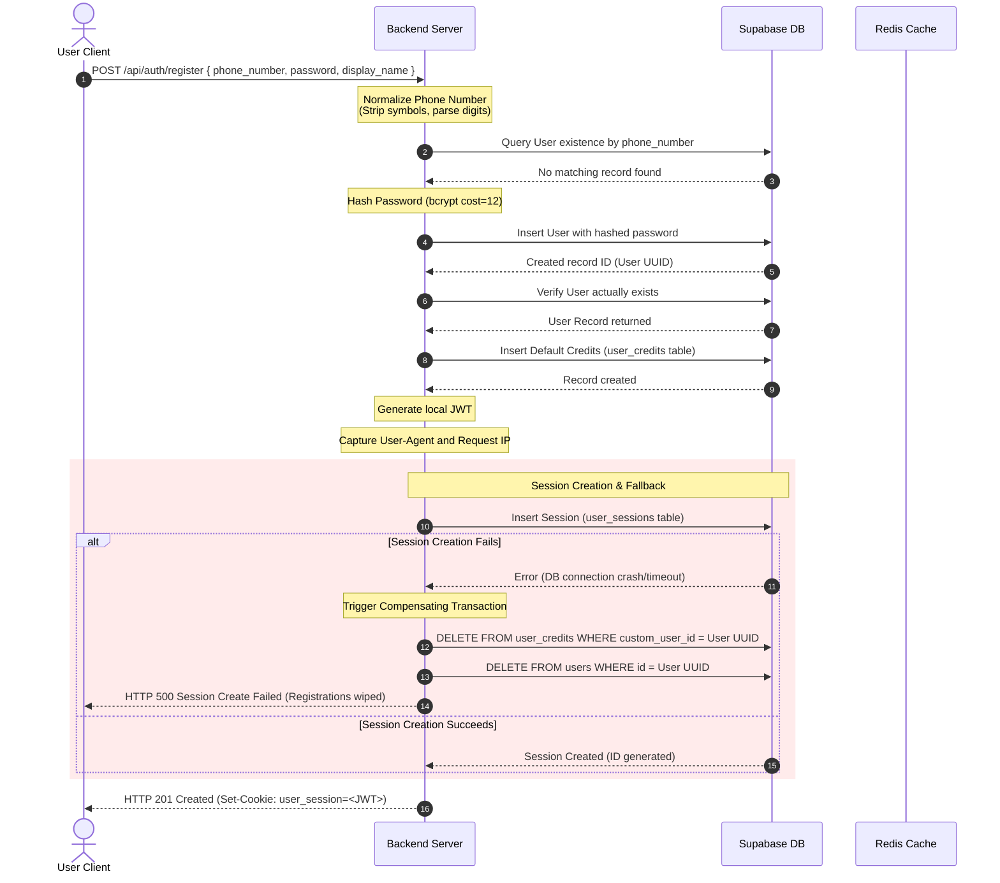
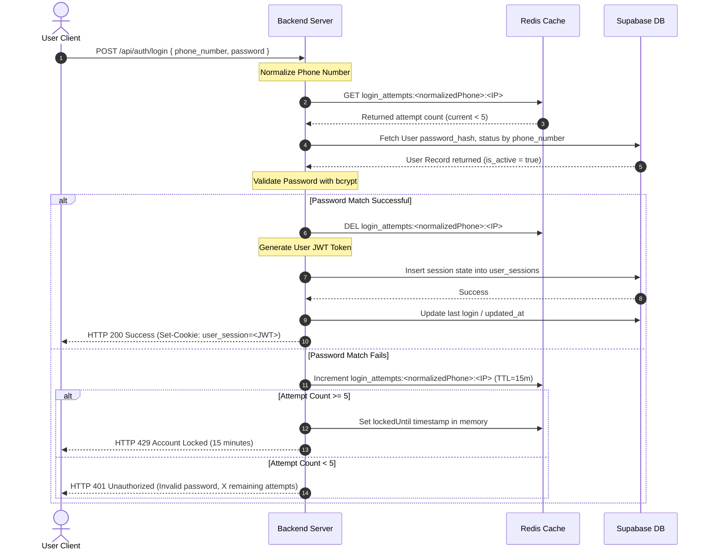
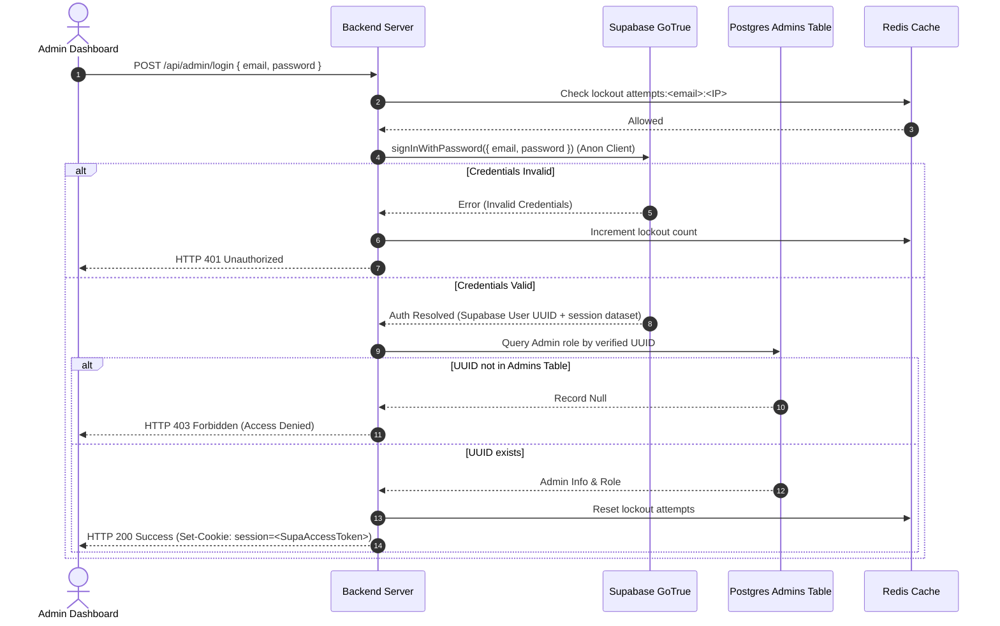
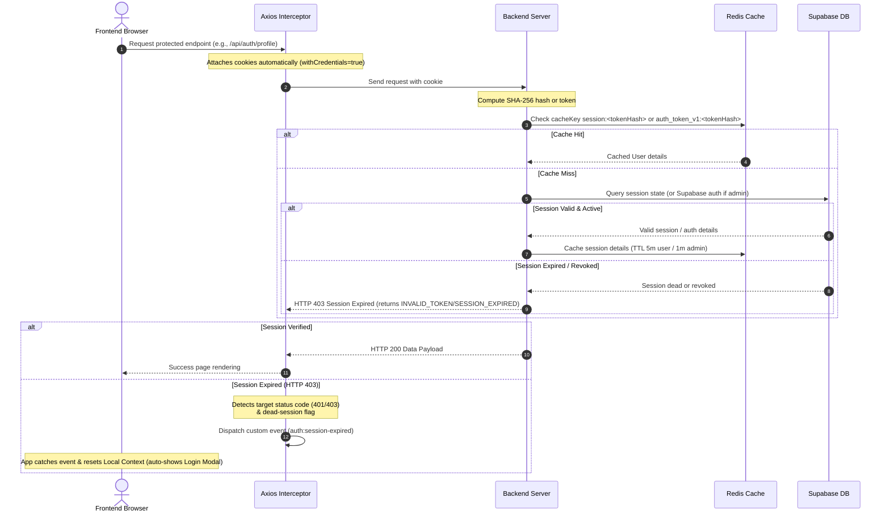
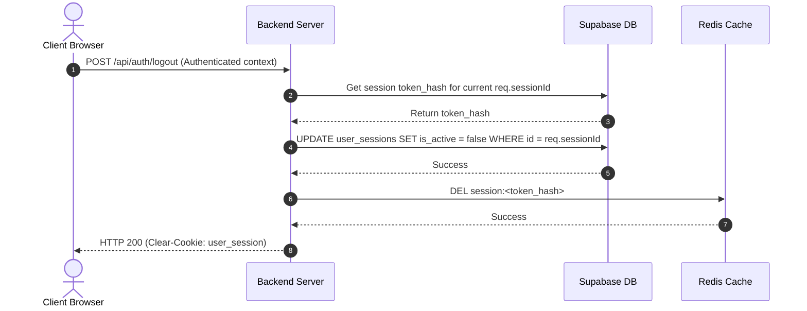
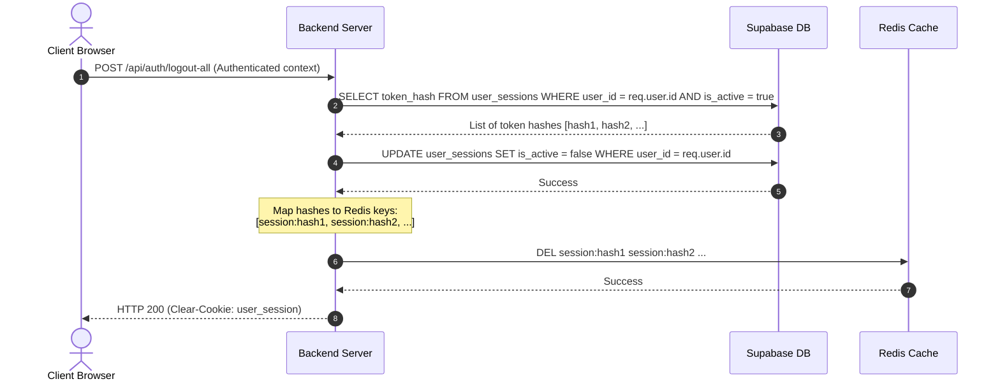

# Authentication & Session Flows

This page provides sequence flow models for registration, login, and authorization validation within the MyClinical platform.

---

## 1. User Registration Flow

Illustrates standard phone registration, database initialization, and compensating rollbacks upon session failure.

---

## 2. Customer & Admin Login Flows

Illustrates authentication, Redis integration, and rate limiting protections.

### Customer Login Flow

### Admin Login Flow

---

## 3. Session Verification & Cookie Interceptors

Shows the token validation pipeline and Axios automated interception.

---

## 4. Session Revocation Flows (Logout / Logout-All)

Illustrates database cleanup and Redis cache clearing.

### Logout Flow

### Logout-All Flow

