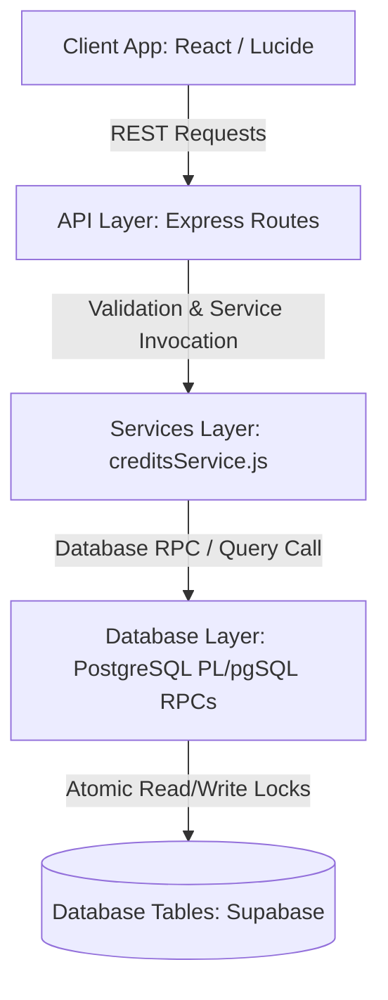
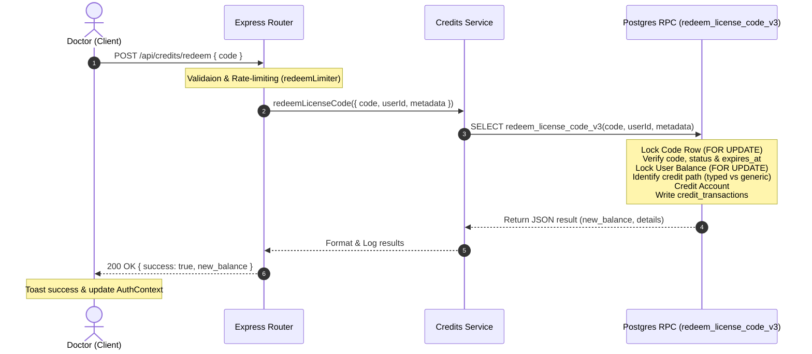
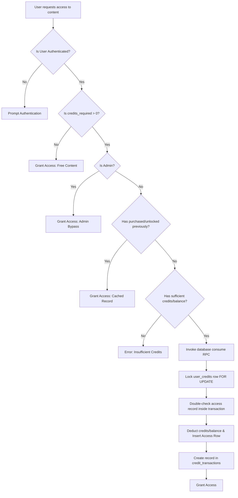

# Credit System Architecture

The MyClinical credit system provides a robust, multi-dimensional ledger model that allows users to acquire and consume access to clinical education resources. It supports both general-purpose credits and scoped (typed) credits restricted to specific course collections.

---

## 1. High-Level Technical Structure

The credit system operates as a layered architecture spanning the client, middleware, backend controllers, and database engines:

### Components Separation of Concerns
- **Database Layer (Supabase/PostgreSQL)**: Acts as the single source of truth for the credit ledger. It enforces transaction isolation levels, performs row-level checks, updates balances atomicially, and maintains ledger journals (`credit_transactions`). High-stakes operations are computed inside database-level RPC functions to prevent race conditions.
- **Backend Services (`creditsService.js`)**: Coordinates database interactions, translates technical PG database errors to user-friendly Arabic application errors (`AppError`), formats responses, and handles logging.
- **API Wrapper Routes (`/api/credits`, `/api/admin/credits`)**: Handles HTTP payload schema validation (via Zod/middleware), manages user session context (verifying `req.user`), and applies security safeguards (rate limiters like `redeemLimiter` and `consumeLimiter`).
- **Client App (React)**: Renders user balances, handles card redemption modal flows, and checks server access permissions before launching resource viewers.

---

## 2. Credit Dimensions & Types

The system handles two main types of credits:

### A. Generic/Global Credits
Stored in the central `user_credits` table, these are platform-wide assets:
1. **Universal Balance (`balance`)**: Generic credits that function as a backup currency. If type-specific credits are depleted, users can pay 1-to-1 using this universal balance.
2. **Video Watch Minutes (`video_watch_minutes`)**: Used with per-minute video courses. Each minute watched decrements this balance by 1.
3. **Article Credits (`article_credits`)**: Scoped to unlock paid medical articles. Unlocking one article costs 1 credit.
4. **Research Credits (`research_credits`)**: Scoped to unlock paid medical research papers. Unlocking one paper costs 1 credit.

### B. Typed/Scoped Credits
Allows the creation of specialized credits (e.g. *Surgical Training Credits*, *Orthodontics Bundle Credits*).
- Managed through three tables: `credit_types`, `credit_type_courses` (defining which courses accept the credits), and `user_typed_credits` (the user's balance per type).
- When purchasing courses, the system searches for appropriate typed credits **before** falling back to the generic `balance`.

---

## 3. End-to-End Conceptual Workflows

### A. Code Redemption (Credit Acquisition)
Users redeem license codes to top up their accounts.

### B. Resource Access & Consumption
When a user accesses paid content (like an article, research paper, or course), credits are consumed.

