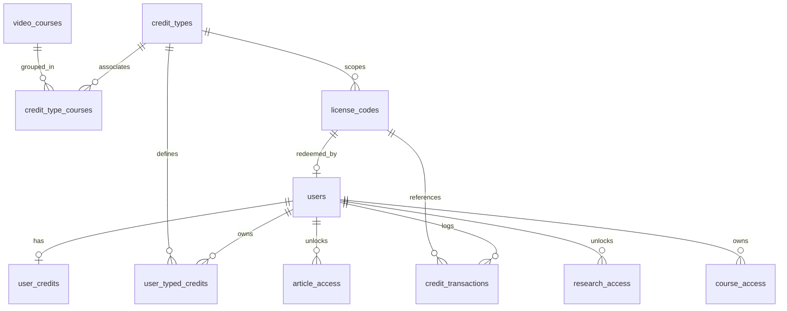

# Database Schema & Storage Logic

The credit system is anchored by a set of relational tables in Supabase (PostgreSQL) and structured database functions (RPCs) that guarantee transactions are processed safely, quickly, and atomically.

---

## 1. Entity-Relationship Schema

The relationships between credit-related entities are structured as follows:

---

## 2. Table Specifications

### A. user_credits
Maintains the general credit balances for each user profile. Let's look at the columns:

| Column Name | Data Type | Default | Constraints / Modifiers | Description |
| :--- | :--- | :--- | :--- | :--- |
| `id` | `uuid` | `gen_random_uuid()` | Primary Key | Internal row identifier |
| `custom_user_id` | `uuid` | `NULL` | Foreign Key (`users.id` ON DELETE CASCADE) | Links to the corresponding user account |
| `balance` | `integer` | `0` | >= 0 | General-purpose exchange currency |
| `video_watch_minutes`| `integer` | `0` | >= 0 | Watch time minutes balance |
| `article_credits` | `integer` | `0` | >= 0 | Credits to unlock articles |
| `research_credits` | `integer` | `0` | >= 0 | Credits to unlock research papers |
| `total_earned` | `integer` | `0` | - | Lifetime amount of credits redeemed/earned |
| `total_spent` | `integer` | `0` | - | Lifetime amount of credits spent |
| `created_at` | `timestamptz`| `now()` | - | Audit timestamp |
| `updated_at` | `timestamptz`| `now()` | - | Last modification timestamp |

- **Indexes**:
  - `user_credits_custom_user_idx` on `custom_user_id` (Unique lookup)

---

### B. credit_transactions
Holds immutable history logs of all credit adjustments.

| Column Name | Data Type | Default | Constraints / Modifiers | Description |
| :--- | :--- | :--- | :--- | :--- |
| `id` | `uuid` | `gen_random_uuid()` | Primary Key | Transaction ref |
| `custom_user_id` | `uuid` | `NULL` | Foreign Key (`users.id` ON DELETE CASCADE) | The affected user's ID |
| `user_id` | `uuid` | `NULL` | - | Legacy fallback column |
| `transaction_type` | `text` | - | CHECK check (`type IN ('redeem', 'usage', 'refund')`) | Type of balance modification |
| `amount` | `integer` | - | Non-zero | Difference (+ for redeem, - for usage) |
| `description` | `text` | - | - | Arabic localized action text |
| `balance_before` | `integer` | - | - | Balance prior to modification |
| `balance_after` | `integer` | - | - | Balance post-modification |
| `related_entity_type` |`text` | `NULL` | e.g. `'license_code'`, `'article'`, `'video_course'` | Entity category that triggered transaction |
| `related_entity_id` | `uuid` | `NULL` | - | UUID identifier of the related entity |
| `metadata` | `jsonb` | `'{}'` | - | Arbitrary JSON parameters (IP, User Agent) |
| `transaction_date` | `timestamptz`| `now()` | - | Audit logging timestamp |

- **Indexes**:
  - `credit_transactions_custom_user_idx` on `custom_user_id`
  - `credit_transactions_date_idx` on `transaction_date DESC`

---

### C. license_codes
Codes that are printed on purchase cards or generated online for campaigns.

| Column Name | Data Type | Default | Constraints | Description |
| :--- | :--- | :--- | :--- | :--- |
| `id` | `uuid` | `gen_random_uuid()` | Primary Key | Code primary identifier |
| `code` | `text` | - | UNIQUE | Cryptographically random unique string |
| `credit_amount` | `integer` | `0` | - | Amount of generic/typed credits added |
| `credit_type` | `text` | `'universal'` | CHECK (`credit_type` IN `('video', 'article', 'universal', 'both', 'research', 'all', 'typed')`) | Category of assets added by the code |
| `credit_type_id` | `uuid` | `NULL` | Foreign Key (`credit_types.id` SET NULL) | Linked type (only if type is `'typed'`) |
| `video_minutes` | `integer` | `0` | - | Watch minutes added (for video/both/all) |
| `article_count` | `integer` | `0` | - | Article unlocks added (for article/both/all) |
| `research_count` | `integer` | `0` | - | Research unlocks added (for research/all) |
| `is_redeemed` | `boolean` | `false` | - | Flag indicating whether code has been redeemed |
| `custom_redeemed_by` |`uuid` | `NULL` | Foreign Key (`users.id` ON DELETE SET NULL) | Account ID that redeemed the code |
| `redeemed_at` | `timestamptz`| `NULL` | - | Timestamp of code usage |
| `expires_at` | `timestamptz`| `NULL` | - | Expiration boundary timestamp |
| `created_at` | `timestamptz`| `now()` | - | Date code record was created |

---

### D. Scoped (Typed) Credits Tables

#### 1. credit_types
Types of credit campaigns, defining prefixes and identifiers.
- `id` (uuid, PK)
- `name` (text) - Localized display name (e.g. "تقويم الأسنان")
- `description` (text)
- `prefix` (text) - Custom alphanumeric prefix (e.g., "ORTH")
- `is_active` (boolean, default `true`)

#### 2. credit_type_courses
Junction table grouping courses that belong to a specific credit type.
- `id` (uuid, PK)
- `credit_type_id` (uuid, FK `credit_types.id` ON DELETE CASCADE)
- `course_id` (uuid, FK `video_courses.id` ON DELETE CASCADE)
- **Unique Constraint**: `UNIQUE(credit_type_id, course_id)`

#### 3. user_typed_credits
Tracks the scoped balances for each user profile.
- `id` (uuid, PK)
- `user_id` (uuid, FK `users.id` ON DELETE CASCADE)
- `credit_type_id` (uuid, FK `credit_types.id` ON DELETE CASCADE)
- `balance` (integer, default `0`, CHECK `balance >= 0`)
- **Unique Constraint**: `UNIQUE(user_id, credit_type_id)`

---

## 3. Database Functions (PL/pgSQL RPC API)

All high-stakes state changes are executed inside Database Functions to ensure speed and serializable isolation, completely protected from runtime Node.js network latencies.

### A. Code Redemption: `redeem_license_code_v3`
Redeems a license code, locks records to prevent double redemption, writes ledger logs, and updates user credits.

1. **Locks Code Row**: `SELECT * ... FROM license_codes WHERE code = p_code FOR UPDATE;`
2. **Guards Validation**: Checks if code exists, is already redeemed, or is expired.
3. **Applies Marks**: Sets `is_redeemed = true`, records user ID and `redeemed_at` timestamp.
4. **Calculates Balance**:
   - **If Scoped (Typed) Credit**: Adds value directly into `user_typed_credits` and sets payload metadata.
   - **If Generic Credit**: Maps to credit type categories (`video`, `article`, `both`, `research`, `all`, `universal`), calculates total earned delta, updates user credits record, and sets transaction logs.

### B. Video Minute Consumption: `consume_video_minutes`
Decrements minutes from user account.
1. **Reads User Balances**: Fetches `video_watch_minutes` and general `balance`.
2. **Prioritization Loop**:
   - Tries to deduct from specialized `video_watch_minutes` if sufficient.
   - Falls back to universal `balance` if watch minutes are insufficient but general balance is available.
3. **Transaction Logging**: Logs matching transaction for the consumption.

### C. Article Unlocking: `consume_article_credit`
Locks and unlocks paywalled articles. Refer to [Verification section](file:///Users/iskandermac/Downloads/project%206/documentation/credits%20system/concurrency-security.md) for how race conditions are avoided.
1. **Locks User Profile**: `SELECT ... FROM user_credits WHERE custom_user_id = p_user_id FOR UPDATE;`
2. **Bypasses Idempotency**: Checks if record already exists in `article_access` table; returns success if found.
3. **Deducts**: Decreases specialized `article_credits` by 1. Falls back to global `balance` by 1.
4. **Saves Log**: Inserts access record inside `article_access` table.

### D. Research Unlocking: `consume_research_credit`
Matches the exact operational flow of `consume_article_credit`, but targets `research_credits`, `research_access`, and general `balance` fallback.

### E. Course Purchase: `purchase_course_access`
Buys a course using credits.
1. **Bypasses Checked Access**: Returns early if access record exists in `course_access` table.
2. **Idempotency Guard**: Checks if transaction exists in `credit_transactions` matching the `idempotency_key` parameter.
3. **Applies Scoped Credits**: Searches `user_typed_credits` matching the `course_id` (links to `credit_types` and `credit_type_courses`). If a balance exists, it uses it first.
4. **Falls Back to General Balance**: If typed credit is unavailable, locks generic `user_credits` and checks universal `balance`.
5. **Grants and Logs**: Inserts course access record and writes transaction log.
