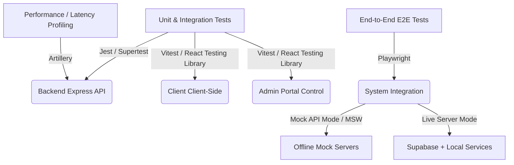
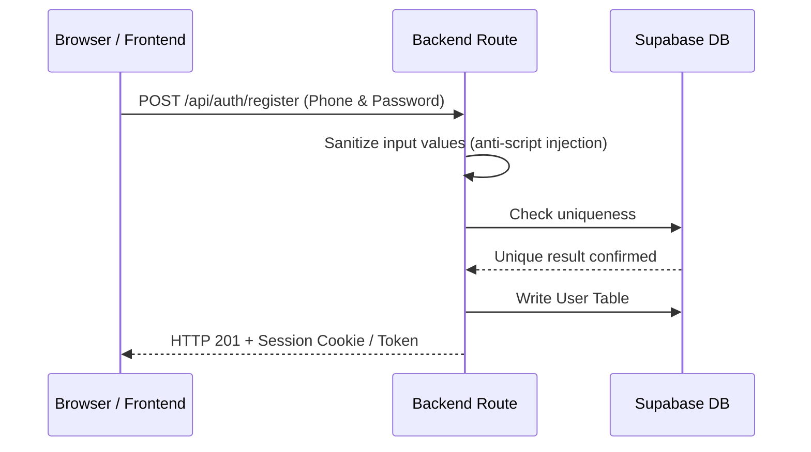
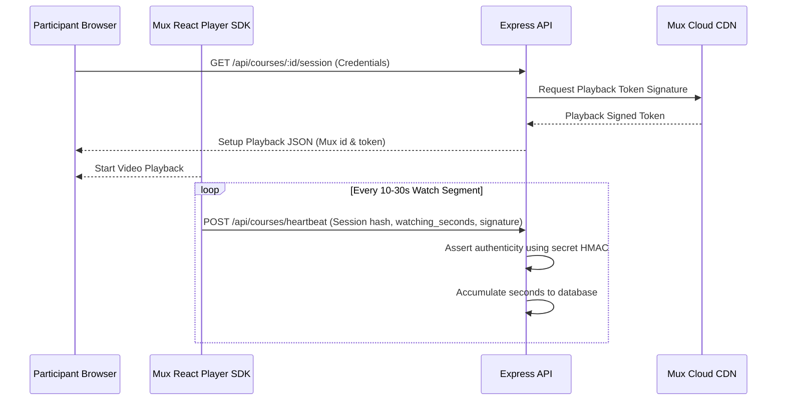
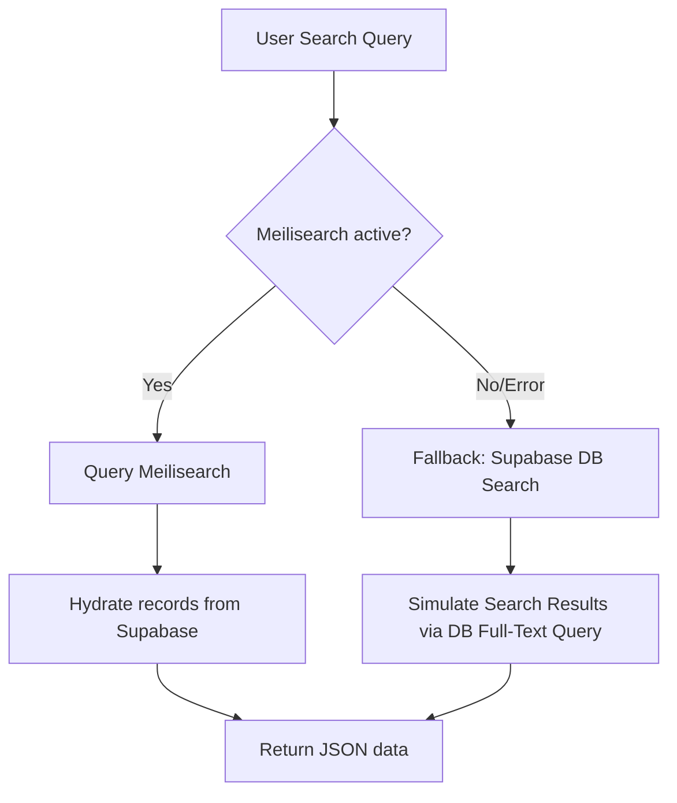

# MyClinical Platform: Comprehensive Testing & Quality Assurance Guide

This guide details the testing architecture, configurations, automated test suites, mocking mechanisms, and manual verification protocols for the MyClinical platform. It serves as a master layout for developers and QA engineers to validate all functional, security, and performance boundaries.

---

## 1. Testing Philosophy & Stack Overview

The platform uses a layered testing approach to maintain software quality, api integrity, and UI experience.

Map of testing layers and components:


### 1.1 Automated Testing Stack Summary

| Testing Layer | Target Component | Framework | Primary Libraries |
| :--- | :--- | :--- | :--- |
| **Backend Integration & Logic** | Routes, Services, Middlewares | Jest | Supertest, pg, Supabase JS, cross-env |
| **Frontend UI Core** | React components, Hooks | Vitest | React Testing Library, User Event, jsdom |
| **Admin Portal UI** | React panels, State | Vitest | React Testing Library, User Event, jsdom |
| **End-to-End (E2E)** | User Journeys & Flows | Playwright | Playwright Test Runner, Dotenv |
| **Load & Stress Testing** | API Endpoint Latency | Artillery | Artillery Core |

---

## 2. Environment Configuration & Setup

### 2.1 File Organization & Environment Files
By default, each service leverages dotenv to parse profile files matching targets:
* **Root Application**: `.env` (Production & Development defaults)
* **API Testing Scope**: Overridden globally via programmatic injection during Jest test initialization inside `backend/__tests__/setup.js`.
* **E2E Testing Scope**: Configured in `.env.e2e` inside the project root.

### 2.2 Local Docker Orchestration (`docker-compose.yml`)
To run full-system checks (including Meilisearch indexing, Prometheus telemetry, and Grafana), you can spin up the supporting containers:

```bash
# Launch background services
docker-compose up -d

# Verify containers are running healthy
docker compose ps
```

Container services definition details:
- **Meilisearch** (`localhost:7700`): Full-text search engine indexer. Requires `MEILI_MASTER_KEY` environment variable.
- **Prometheus** (`localhost:9090`): Visualizes raw system telemetry, including api error codes and route processing time.
- **Grafana** (`localhost:3000`): Visual dashboard panels tracking server health logs.

---

## 3. Backend Testing (Jest & Supertest)

The Express API is tested via integration tests verifying routing, validation rules, input sanitization, rate limits, schema access constraints (RLS), and database queries.

### 3.1 Setup And Configuration
The test workspace is defined in `backend/jest.config.js`:
```javascript
export default {
    transform: {},
    testEnvironment: 'node',
    verbose: true,
    testMatch: ['**/__tests__/**/*.test.js'],
    setupFiles: ['<rootDir>/__tests__/setup.js'],
    moduleNameMapper: {
        '^pdf-parse$': '<rootDir>/__mocks__/pdf-parse.cjs'
    }
};
```

### 3.2 Running the Suite
Execute the following commands in the `backend/` directory:
```bash
# Run all tests sequentially (recommended to prevent lock conflicts in test DB)
npm run test

# Run a single target test suite
npx jest __tests__/credits.test.js

# Target tests matching a pattern, displaying open async resource handles
npx jest search -t "fallback" --detectOpenHandles --forceExit
```

### 3.3 System Mocking & Intercepting Architecture

#### A. Database (Supabase) Mock Setup
To test API routes without hitting the live cloud database, the application utilizes `backend/__tests__/mocks/supabaseMock.js` to simulate database records.
Example usage for mocking dynamic database queries:
```javascript
import { jest } from '@jest/globals';
import { mockSupabase, resetSupabaseMock } from './mocks/supabaseMock.js';

// Intercept client construction
jest.unstable_mockModule('@supabase/supabase-js', () => ({
    createClient: jest.fn(() => mockSupabase)
}));

beforeEach(() => {
    resetSupabaseMock(); // Resets mock callback states
});

it('should retrieve database profile records', async () => {
    mockSupabase.single.mockResolvedValueOnce({
        data: { id: 'usr_01', display_name: 'Dr. Ahmad' },
        error: null
    });
    // Triggers underlying code...
});
```

#### B. Redis & Rate-Limit Mocking
Redis keys and rate-limit middleware logic are mocked to ignore delays unless asserting limit thresholds.
```javascript
jest.unstable_mockModule('../middleware/rateLimiter.js', () => ({
    searchLimiter: (req, res, next) => next(), // pass-through
    redeemLimiter: (req, res, next) => {
        // Mock specific quota counters
        next();
    }
}));
```

#### C. Sentry Logger Interception
Sentry telemetry hooks are verified by mocking `@sentry/node`:
```javascript
jest.unstable_mockModule('@sentry/node', () => ({
    captureException: jest.fn(),
    captureMessage: jest.fn(),
    init: jest.fn()
}));
```

---

## 4. Frontend & Admin control testing (Vitest & RTL)

Client-side applications use **Vitest** for DOM compilation checks combined with **React Testing Library**.

### 4.1 CLI Commands
Navigate to either the `client/` or `admin/` workspace folders:
```bash
# Run existing unit and visual component tests
npm run test

# Keep tests active (watch mode)
npm run test:watch

# Execute tests with UI interface dashboard
npx vitest --ui
```

### 4.2 Handling Complex Wrappers & State Providers
Many React components depend on parent context providers (`AuthContext`, `React Router`, `TanStack Query`). A custom test helper should be used:
```tsx
import React from 'react';
import { render } from '@testing-library/react';
import { QueryClient, QueryClientProvider } from '@tanstack/react-query';
import { MemoryRouter } from 'react-router-dom';

export function renderWithAppProviders(ui: React.ReactElement) {
    const testQueryClient = new QueryClient({
        defaultOptions: {
            queries: { retry: false, cacheTime: 0 }
        }
    });

    return render(
        <QueryClientProvider client={testQueryClient}>
            <MemoryRouter>
                {ui}
            </MemoryRouter>
        </QueryClientProvider>
    );
}
```

---

## 5. End-to-End (E2E) Browser Testing (Playwright)

Playwright runs full Chromium/Firefox scenarios validating real user interactions.

### 5.1 CLI Executions
Run from the `client/` or `admin/` workspace paths:
```bash
# Execute headless e2e tests
npm run e2e

# Run tests in headed UI (opens automation browser window)
npm run e2e:headed

# Open Playwright interactive trace viewer for detail inspection
npm run e2e:ui
```

### 5.2 Critical Playwright Security Configs
Standard Content Security Policies (CSP) may prevent mocking libraries or cross-origin actions from running.
Ensure **`bypassCSP: true`** and launch arguments are set in `playwright.config.ts`:
```typescript
export default defineConfig({
  testDir: './e2e',
  timeout: 30000,
  use: {
    baseURL: 'http://127.0.0.1:5173',
    bypassCSP: true, 
  },
  projects: [
    {
      name: 'chromium',
      use: {
        ...devices['Desktop Chrome'],
        launchOptions: {
          args: ['--disable-web-security'] // Bypass browser boundaries for sandbox calls
        }
      },
    },
  ],
});
```

---

## 6. Detailed Feature Test Frameworks

### 6.1 Authentication & Profile Setup



#### Automated Test Verification Details
- File: [`backend/__tests__/login_security.test.js`](file:///Users/iskandermac/Downloads/project%206/backend/__tests__/login_security.test.js) & [`unified_auth.test.js`](file:///Users/iskandermac/Downloads/project%206/backend/__tests__/unified_auth.test.js)
- Verifies: Rate limit configurations (429 blockers), password validation criteria, and session duration keys.

#### Step-by-Step Manual QA Script
1. **Successful Account Signup**:
   - Navigate to `/register`.
   - Enter Syrian/regional phone layouts matching standard formats (e.g. `0911223344`).
   - Enter password meeting complexity expectations (minimum 8 characters, at least 1 digit, 1 uppercase letter).
   - Click "Register". Ensure you are redirected to profile customization, and verify database creates a corresponding row.
2. **Input Invalidation Checks**:
   - Input letters in the phone field or passwords. Try submitting.
   - Verify frontend prevents submission and triggers field warning labels.
3. **Logout & Guarded Routes**:
   - Access the dashboard, click "Logout" in menu.
   - Using browser dev tools, verify cookies are cleared (`SessionToken`).
   - Try to manually type URL path `/billing-system`. Verify page forces redirect to `/login`.

---

### 6.2 Billing & Credits System

Redeeming license codes, credit validation checks, and double-spend transaction locks.

#### Automated Test Verification Details
- File: [`backend/__tests__/credits.test.js`](file:///Users/iskandermac/Downloads/project%206/backend/__tests__/credits.test.js)
- Verifies: `POST /api/credits/redeem` validation rules, database transaction locks on concurrent consume calls, and credit deduction rules.

#### Step-by-Step Manual QA Script
1. **Redemption Mechanism**:
   - Under Supabase dashboard database client, insert a new code structure in `license_codes` table (e.g., code `E2E-TESTING-123` with 5 Article Credits, set `is_redeemed = false`).
   - Log into frontend client portal as a test user.
   - Go to credit dashboard or Profile setting, type code `E2E-TESTING-123` in redemption input form. Submit.
   - Check that Balance Indicator updates to `5 Credits` and database row transitions to `is_redeemed = true`.
2. **Double-Spend Guard Check**:
   - Attempt to type and submit `E2E-TESTING-123` again.
   - Verify error pop-up states: "This code was already redeemed" (No database modification should execute).
3. **Usage Threshold Check**:
   - Identify an asset or course requiring `3 Credits` for entry.
   - Set user balance in database to exactly `2 Credits`.
   - On the web client, attempt to access the resource. Verify permission is denied and the browser requests the user to redeem more credit.

---

### 6.3 Courses & Video Playback (Mux Streaming)

Validating Mux streaming sessions, heartbeat tracking watch-time, and user validation updates.

#### Playback Lifecycle


#### Automated Test Verification Details
- File: [`backend/__tests__/unit/coursePlaybackService.test.js`](file:///Users/iskandermac/Downloads/project%206/backend/__tests__/unit/coursePlaybackService.test.js) & [`backend/__tests__/unit/muxService.test.js`](file:///Users/iskandermac/Downloads/project%206/backend/__tests__/unit/muxService.test.js)
- Verifies: Playback signature generation, watch time accumulations, and signature validation.

#### Step-by-Step Manual QA Script
1. **Heartbeat Security Verification**:
   - Log in and open a video course page. Press Play.
   - Open Developer console network tab (F12) and inspect `/api/courses/heartbeat` calls.
   - Copy the request payload representation: `{ session_id: "...", watched_seconds: 10, hmac: "..." }`.
   - Using a API Client (e.g. Postman), modify `watched_seconds` to `3600` (spoofing one hour watched) and send with same hmac hash.
   - Verify backend returns `400 Validation Error` (protecting against watch-time spoofing).
2. **Access Control Check**:
   - Access the Mux video embed stream URL directly outside the site context.
   - Ensure the server refuses connection because of missing sign-in token headers and site referrer restrictions.

---

### 6.4 Meilisearch Fallback Search Flows

To prevent global search outages when Meilisearch goes offline, search queries fall back to Supabase database search.



#### Automated Test Verification Details
- File: [`backend/__tests__/search_integration.test.js`](file:///Users/iskandermac/Downloads/project%206/backend/__tests__/search_integration.test.js)
- Verifies: Return data formatting when Meilisearch handles query, fallback validation rules when Meilisearch returns errors, and query sanitization utility.

#### Step-by-Step Manual QA Script
1. **Healthy Search Validation**:
   - Enter `implant` in search bar and click search.
   - Confirm article results show fast (10-50ms) hydration.
2. **Meilisearch Failure Fallback Validation**:
   - Simulate a server crash by turning off the container:
     ```bash
     docker compose stop meilisearch
     ```
   - Go to website and input `implant` in search.
   - Confirm search continues working correctly (verifying fallback active, response payload contains `{ fallback: true }`).
   - Re-enable the container once verification is complete:
     ```bash
     docker compose start meilisearch
     ```

---

## 7. Performance & Load Verification (Artillery)

API stress endpoints are analyzed via standard load patterns using Artillery configuration files configuration in the project.

### 7.1 Artillery Configuration Overview
Define load phases mimicking virtual users inside `artillery.yml`:
```yaml
config:
  target: "http://127.0.0.1:5001"
  phases:
    - duration: 60
      arrivalRate: 5
      rampTo: 25
      name: Warm up phase
    - duration: 120
      arrivalRate: 25
      name: Stress phase
  defaults:
    headers:
      Content-Type: "application/json"
scenarios:
  - name: "Authentication and Dashboard flow"
    flow:
      - post:
          url: "/api/auth/login"
          json:
            phone_number: "0911223344"
            password: "TestPassword123"
      - get:
          url: "/api/credits/balance"
```

### 7.2 Run Load Simulations
Execute:
```bash
# Run performance scans
cd backend && npm run test:load
```

Review outputs:
- **`http.codes.200`**: Maximize this count. If 4xx/5xx errors occur, check express rate limit configs.
- **`http.latency.p95`**: 95% of queries must process within < 200ms for stable production environments.
