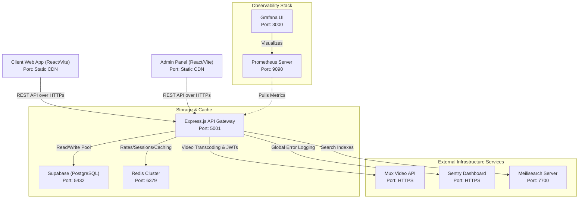

# Operations & Development Safety Guide

This guide details the operational procedures, deployment patterns, telemetry monitoring, and developer guardrails for the MyClinical platform. It outlines specific hazards and precautions to take when modifying the codebase, database, or credits system to prevent downtime, security violations, and data inconsistencies for live users.

---

## 1. System Architecture Overview

MyClinical operates as a multi-component distributed product with the following architecture:



### Component Details
- **Client & Admin Panels**: Single-page applications built on React 18, TypeScript, and Vite. CSS styling is driven by TailwindCSS.
- **Express Backend API**: Handles routing, controller actions, rate limiting, cache orchestration, input sanitization, and third-party integrations (Mux, Sentry, Meilisearch).
- **Supabase (PostgreSQL)**: Houses relational data, triggers, views, and raw schemas. Security is governed by strict **Row Level Security (RLS)** flags.
- **Redis Cache & Limiter**: Used for transient caching of public GET requests and serving rate limits dynamically.
- **Meilisearch**: Indexes articles, research abstracts, and courses.
- **Mux**: Powers video hosting, secure player configurations, and signed JWT token exchanges.
- **Observability (Prometheus, Grafana, Sentry)**: Monitors API traffic throughput, visualizes operational health metrics, and aggregates runtime errors.

---

## 2. Production Environment Variables Reference

### Backend Configurations (`backend/.env`)

These credentials must be provisioned in the production environment. Using dummy templates will cause startup crashes.

| Variable Name | Priority | Strict Safety & Validation Guardrails |
| :--- | :--- | :--- |
| `NODE_ENV` | **REQUIRED** | Set to `production`. Triggers security checks. |
| `PORT` | **REQUIRED** | Default: `5001`. Must be clamped between 1 and 65535. |
| `SUPABASE_URL` | **REQUIRED** | Must start with `https://`. Failure crashes server lifecycle. |
| `SUPABASE_ANON_KEY` | **REQUIRED** | Client-safe anonymous API key. |
| `SUPABASE_SERVICE_ROLE_KEY` | **CRITICAL** | Overrides RLS. **NEVER** expose to the client. |
| `JWT_SECRET` | **CRITICAL** | Must be at least 32 characters in production. |
| `ATTENTION_HMAC_SECRET` | **CRITICAL** | HMAC secret used to sign video progress heartbeats. |
| `ALLOWED_ORIGINS` | **CRITICAL** | Comma-separated domains. Do not use wildcards (`*`) in production. |
| `REDIS_URL` | **REQUIRED** | Address of the Redis store (e.g. `redis://localhost:6379`). |
| `SEARCH_PROVIDER` | **REQUIRED** | Define as `meilisearch`. |
| `MEILI_URL` | **REQUIRED** | Meilisearch server address (e.g. `http://localhost:7700`). |
| `MEILI_MASTER_KEY` | **CRITICAL** | Authorization master key matching Meilisearch container configuration. |
| `MOCK_VIDEO_API` | **WARNING** | **Must compile to `false` in production.** Bypasses Mux checks when true. |
| `PLAYBACK_SESSION_TTL_SECONDS` | OPTIONAL | Expiration time for playback sessions (clamped: 60s - 120s, default: `75`). |
| `STRICT_SECURITY` | OPTIONAL | If set to `true`, the process terminates immediately if security validations fail. |
| `GRAFANA_ADMIN_PASSWORD` | **CRITICAL** | Admin login credential for Grafana dashboards. |

#### Backend Startup Security Inspections
Upon launch, `backend/server.js` triggers two modules to scan the state of the environment:
1. `validateEnvironment()`:
   * Ensures essential variables (`SUPABASE_URL`, `SUPABASE_ANON_KEY`, `SUPABASE_SERVICE_ROLE_KEY`, `NODE_ENV`) are defined.
   * Confirms `SUPABASE_URL` starts with `https://`.
   * Validates that `PORT` and `MAX_FILE_SIZE` are positive integers.
   * Scans inputs for default template values (e.g., `your_supabase_url`). If found, startup terminates with exit code `1`.
2. `validateProductionSecurity()`:
   * Triggers only when `NODE_ENV === 'production'`.
   * Enforces a minimum length of 32 characters for `JWT_SECRET`.
   * Logs warnings if default fallback credentials are detected.
   * Terminated immediately if `STRICT_SECURITY === 'true'` and violations exist.

### Client & Admin Configurations (`client/.env`, `admin/.env`)

| Variable Name | Priority | Scope |
| :--- | :--- | :--- |
| `VITE_SUPABASE_URL` | **REQUIRED** | Public client-side Supabase URL. |
| `VITE_SUPABASE_ANON_KEY` | **REQUIRED** | Public key for client database calls. |
| `VITE_API_URL` | **REQUIRED** | Express backend hostname (e.g. `https://api.myclinical.com`). |

---

## 3. Setup & Deployment Operations

Follow this sequence to deploy or boot the application stack:

### Step 1: Start Docker Sidecars
Before spinning up the app servers, launch the database dependencies and observability suite:
```bash
docker-compose up -d --build
```
This launches:
- **Meilisearch** on port `7700`
- **Prometheus** on port `9090`
- **Grafana** on port `3000`

### Step 2: Apply Database Schema & Migrations
Synchronize migration state to target Supabase host:
```bash
# Push schema files to target database
supabase db push
```
> [!WARNING]
> Do not execute raw schema changes inside the Supabase control UI. Maintain migrations in order to guarantee system stability across local, staging, and production environments.

### Step 3: Run the Express Backend
Install project dependencies and start the Node process:
```bash
cd backend
npm install
# In Development:
npm run dev
# In Production:
npm start
```

#### Verifying System Connection Health
Query the health check endpoint to ensure dependencies are connected:
```bash
curl http://localhost:5001/health
```
**Expected Response Content:**
```json
{
  "status": "OK",
  "security": "enabled",
  "timestamp": "2026-07-27T11:45:00.000Z",
  "environment": "production",
  "dependencies": {
    "supabase": "CONNECTED",
    "redis": "CONNECTED",
    "meilisearch": "CONNECTED"
  }
}
```
*If a dependency connectivity check fails or timeouts, the status will downgrade to `"DEGRADED"` and the endpoint returns a `207` multi-status code.*

### Step 4: Compile Frontend SPA Assets
Compile static frontends for deployment to CDNs:
```bash
# Client
cd client && npm install && npm run build

# Admin
cd admin && npm install && npm run build
```
This writes standard HTML, JavaScript, and CSS bundle resources to `client/dist` and `admin/dist`.

---

## 4. Maintenance Operations

### Search Index Maintenance (Meilisearch)
If database content shifts or search caches become out of sync, execute full-text reindexing:
```bash
cd backend
# Direct execution (bypasses script path mismatch inside package.json)
node scripts/reindex_meili.js
```
> [!IMPORTANT]
> The backend `package.json` script target `"reindex:meili"` points to `scripts/maintenance/reindex_meili.js`. However, the script is located at `scripts/reindex_meili.js`. Use the direct execution statement above to ensure the indexer runs.

### Telemetry & Diagnostics Dashboard Setup
1. **Network Performance Monitoring**: Access the Grafana portal on port `3000`. Configure Prometheus (`http://prometheus:9090` internally inside Docker network) as a metrics datasource. Inspect backend throughput metrics via `express-prom-bundle`.
2. **Error Logging**: Inspect uncaught runtime failures on the Sentry interface. When shipping newer client/backend releases, verify release tags to correlate stack traces with matching Git commits.

---

## 5. Developer Guardrails & Live User Hazards

### Zero-Downtime Database Migration Policy
> [!CAUTION]
> Modifying or deleting live tables can break active UI calls.

When developing migration scripts in `supabase/migrations/`:
- **Do not introduce `NOT NULL` columns without default constraints.** Adding a raw `NOT NULL` column to an active table without a fallback value causes inserts from active, pre-deployment client versions to fail immediately.
- **Implement "Expand & Contract" schemas.** To rename or convert a column:
  1. Add the new column as nullable (`ALTER TABLE ADD COLUMN new_name ...`).
  2. Modify code to write to both the old and new columns, but read only from the old.
  3. Backfill data from old fields to new fields using a background SQL script.
  4. Edit code to read and write exclusively to the new column.
  5. Remove the old field in subsequent migration phases.
- **Secure Row Level Security (RLS) policies.** Ensure all new tables have `ALTER TABLE name ENABLE ROW LEVEL SECURITY` declared. Define specific access control grants for individual roles (e.g. `authenticated`, `anon`).

### Caching Architecture & Cache Invalidation Cautions

The Redis cache pattern is optimized to speed up responses while protecting against data leakage.

```
Request GET /api/articles
   |
   +---> Auth Header Present?
            |
            +---> [Yes] -> Bypass Cache (Go to Database) -> Next()
            |
            +---> [No]  -> Check Redis cache:key
                              |
                              +---> [Found] -> Return Cached JSON
                              |
                              +---> [Miss]  -> Query Database -> Save JSON in Redis -> Return
```

- **Cache Routing Strategy**: Caching is restricted strictly to unauthenticated `GET` endpoints. The `cacheMiddleware` intercepts keys structured as `cache:${req.originalUrl || req.url}`.
- **Preventing Stale Data**: When writing code that modifies cached models (like updating articles, research documents, or category definitions), you must invalidate cached endpoints:
  ```javascript
  import { invalidateCachePattern } from '../../middleware/cache.js';
  // Clear all cached article routes
  await invalidateCachePattern('cache:/api/articles*');
  ```
- **Avoid Key Lockups**: `invalidateCachePattern` runs the Redis `SCAN` command iteratively instead of `KEYS` to query matched collections. This prevents Redis blocks in large-scale deployments. Always query matching patterns with a trailing wildcard `*`.

### Credit Ledger Protection & RPC Transactions

The credits ecosystem manages user account credentials, course videos watch minutes balances, article view quotas, and research tokens.

- **Idemptotency and Race Conditions**: Deducting balance values requires strict transactional locks. Multiple simultaneous requests (double-spending attempts) are mitigated by using Supabase database functions (RPCs).
- **Critical RPC Functions**:
  1. `redeem_license_code_v3`: Redeems license vouchers. Includes audits for concurrent claims.
  2. `consume_video_minutes`: Deducts video watch time and increments course progress.
  3. `consume_article_credit` & `consume_research_credit`: Charges users when accessing paid publications.
- **Handling Database Level Redundancy**:
  The backend expects PostgreSQL constraint exception codes, such as unique key violation `23505` (e.g. a user requesting access to an article they have already unlocked). Handle these checks gracefully in the controller layer as a warning to prevent client crashes:
  ```javascript
  if (error.code === '23505') {
    logger.warn('Conflict encountered in consume_article_credit - fallback to success', { userId, articleId });
    return { success: true };
  }
  ```
- **Ledger Security & Rate Limits**: Protect ledger update routes with dedicated rate limiting middlewares to block automated brute-force scripts:
  * `redeemLimiter`: App-level client block limiters.
  * `accountRedeemLimiter`: Prevents brute-forcing codes on a target account.
  * `consumeLimiter`: Prevents client-side media consumption loops from dry-running user assets.

### Mux Playback Custom Security Checks

Video playback utilizes short-lived signed secure credentials:

- **Playback TTL Window**: The playback session expiration window is governed by `PLAYBACK_SESSION_TTL_SECONDS` (clamped between `60` and `120` seconds, defaulting to `75` seconds).
- **Mux Signed Tokens**: When utilizing Mux signed playback:
  1. The code decodes the base-64 `MUX_SIGNING_PRIVATE_KEY` or `MUX_SIGNING_KEY_PRIVATE_KEY` block.
  2. Signs three distinct JWT tokens using RS256 algorithm:
     * Playback URL signature (`v`)
     * Thumbnail image signature (`t`)
     * Storyboard script signature (`s`)
  3. The signature's TTL is dynamically matched to the server's session `expires_at` value. This prevents clients from copying playback manifest URLs and circumventing billing.
- **Attention Verification Heartbeat**:
  Courses requiring attention checks spawn interactive verification challenges via `generateChallenges()`.
  * The frontend client must respond to these checks at randomized intervals (`attention_check_interval_min` to `attention_check_interval_max`) by answering prompts.
  * Attention responses are cryptographically signed using `ATTENTION_HMAC_SECRET`. Heartbeat progress stops if validation calls fail.

### Security Defenses (XSS, CORS, Auth)
- **CORS Policies**: Never define `Access-Control-Allow-Origin: *` in production when credentials are sent. Use the backend middleware configuration to parse `ALLOWED_ORIGINS` dynamically.
- **Cookie Setup**: User sessions are handled with `httpOnly` secure cookies. When configuring write authorization headers, specify:
  ```javascript
  res.cookie('token', token, {
    httpOnly: true,
    secure: true,
    sameSite: 'strict',
    maxAge: 7 * 24 * 60 * 60 * 1000 // 7 Days
  });
  ```
- **XSS Protections**: Sanitize rich text inputs using strict backend sanitize functions. Always render custom HTML elements in client React views using `dompurify`:
  ```javascript
  import DOMPurify from 'dompurify';
  const CleanContent = ({ content }) => {
    const cleanHtml = DOMPurify.sanitize(content);
    return <div dangerouslySetInnerHTML={{ __html: cleanHtml }} />;
  };
  ```
- Do not bypass this sanitization step to prevent malicious script injection.
